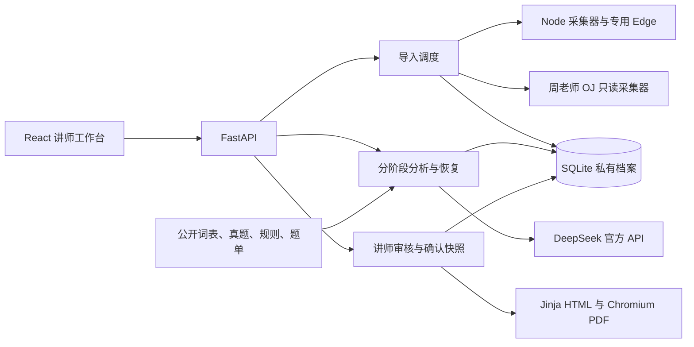

# 开发说明

[返回项目说明](../README.md) · [接口说明](api.md) · [部署维护](operations.md)

## 模块与数据流



| 位置 | 责任 |
| --- | --- |
| `backend/app.py` | 路由、本机访问边界、后台任务、审核、备份 |
| `backend/models.py` | 严格输入与 AI 结果模型；未知字段拒绝，日期与完成条件校验 |
| `backend/db.py` | SQLite、学生信息快照、档案去重、阶段结果、revision、确认版本 |
| `backend/acgo.py` | 两个平台共用的导入调度、子进程、受控并发、结果核对 |
| `integrations/acgo/collector.mjs`、`core.mjs` | ACGO 分页、身份与题目映射、日期过滤、代码与成绩归属 |
| `backend/csp_exam.py`、`html_tree.py` | 周老师 OJ 指定比赛解析、管理员只读连接、OI 最终作品 |
| `backend/pipeline.py`、`batching.py` | 逐题诊断、汇总评分、历年预测、训练、文案、分批与恢复 |
| `backend/provider.py` | 官方 API、结构化结果、重试、超时、并发与调用事件 |
| `backend/evidence.py`、`attempts.py`、`validation.py` | 材料编号、版本筛选、成绩归属、评分与家长文案检查 |
| `backend/parent_style.py` | A 版共同文风、匿名完整样例、写作与纠错提示 |
| `backend/knowledge.py`、`library_audit.py` | 固定维度、参考卷开放、内容指纹、同年广东等级换算 |
| `backend/practice.py` | 已核实题单筛选、链接生成与推荐校验 |
| `backend/report.py`、`templates/report.html` | 图表、HTML 快照、PDF；不加载远程资源 |
| `frontend/src/` | 学生、导入、折叠题目、材料表单、审核、资料与设置 |
| `scripts/` | 安装启动、资料维护、备份恢复与检查工具 |

ACGO 复用了原爬虫的 MIT 辅助代码，来源版本和许可见 [SOURCE.json](../integrations/acgo/vendor/SOURCE.json) 与 [LICENSE](../integrations/acgo/vendor/LICENSE)。新采集器只导入选定学生，不使用原工具的全团队输出流程。

## 持久化与状态

私有目录默认为 `data/private/`，由 `FEEDBACK_DATA_DIR` 切换。四张主表：`students`、`practice_archives`、`feedbacks`、`versions`。档案按学生及内容哈希去重，忽略抓取时间；同一题跨不同作业、比赛保留不同完成情境。

报告状态为 `draft → running → review → confirmed`。失败转 `failed`，恢复再次进入 `running`；成功文案更新回 `review`。重启把尚在 `running` 的报告标记为可恢复。采集任务状态 `running / completed / failed / cancelled` 存内存，完成预览最多保留约一小时，重启后失效；已保存做题档案仍在数据库。

`feedbacks.stages` 保存每题、分批汇总、每年卷、训练和文案，以及历史、词表、规则、题单、参考卷快照。恢复前检查缓存结构和依据，只复用有效结果。输入材料仅在分析尚未开始的 `draft` 可修改，开始后另建反馈。保存审核携带当前 `revision`，成功加一，旧 revision 拒绝。

确认版内容写入 `versions`，HTML 写入私有 `html/`，首次下载 PDF 写入 `pdf/` 并缓存。模板变化不会回写旧快照。新增排版需新确认版本；不要直接修改确认版文件。

并发边界：同时最多两份报告后台工作；导入批次串行排队、每批 1—8 份任务，采集进程全局最多 8 个；每份报告 API 并发 1—8。锁和任务都在单个服务进程内，不支持多 worker / 多实例共用数据库作为正式部署方式。

## 修改约定

- 先读根目录 [AGENTS.md](../AGENTS.md)，家长文字遵循第一原则及 A 版样例；内部诊断与家长写作提示分开。
- 评分依据区分本期、历史、讲师观察、系统推断；不得根据未提交或 OI 最终提交次数编造行为。
- 修改提示词更新 `PROMPT_VERSION`，修改共同文风更新 `STYLE_ID`；审核、词表、规则和题单保留各自版本。不要清空已确认版本。
- 首次生成、恢复、更新文案和校验重试须使用同套写作规则；题单标题与链接由程序从核实记录生成。
- 不重新引入本地编译、测试数据包、Docker 评测或停用的自招执行逻辑；保留平台原始评测信息。
- 导入与服务间采用严格模型，ACGO 雪花 ID 保持字符串，禁止不安全的 JavaScript 数字转换。
- `.gitignore` 排除密钥、真实 `.env`、私有库、原始抓取缓存、依赖、构建产物和临时输出。提交前检查差异，不附带真实学生材料；公开提交与历史范围见[发布说明](publishing.md)。

## 检查与测试

常规命令在项目根目录执行：

```bash
export PATH="$PWD/.tools/node/bin:$PATH"
.venv/bin/python -m pytest -q
npm --prefix integrations/acgo test
npm --prefix frontend run build
```

后端测试使用临时数据库与 mock API，不发送真实 DeepSeek 请求；采集单测验证分页、ID、映射、代码与日期规则。当前收尾结果见 [RELEASE_CHECKS.md](../RELEASE_CHECKS.md)。

| 检查脚本 | 行为与使用条件 |
| --- | --- |
| `check_pdf.py` | 虚构材料生成图表及分页 PDF，仅写 `tmp/pdfs/`，不建学生、不调用 API |
| `check_ui.py` | 浏览器走演示建档、审核、确认；会写入当前服务数据库 |
| `check_acgo_ui.py`、`check_acgo_archive.py` | 需要显式学生与任务参数；读取平台并可能保存测试档案 |
| `check_zhou_oj_ui.py` | 需要指定学生、比赛和已配置连接；读取并保存材料 |
| `check_mixed_archive.py` | 使用指定已有档案验证混合材料并保存一份材料草稿，不爬取平台、不调用 DeepSeek |
| `check_analysis_ui.py` | 只读指定反馈界面，以浏览器拦截结果验证进度与设置；不保存设置 |

带参数脚本可先运行 `--help`。不要在正式库直接运行会新建档案的检查。隔离 UI 验证时新开测试目录和服务，**确保原服务已经停止，或检查脚本指向正确的测试端口**：

```bash
FEEDBACK_DATA_DIR="$PWD/tmp/ui-check-data" bash scripts/start.sh
```

自动测试通过不能覆盖未来 OJ 页面变化或所有模型返回。新改动只运行与其有关的必要检查；涉及 PDF 布局时运行 `check_pdf.py` 并查看实际渲染，不能仅凭页数通过。

## API 与运行边界

路由见[接口说明](api.md)，运行服务的 `/docs`、`/openapi.json` 提供实际 Schema。当前无第三方 SDK、账号鉴权和公网服务；写请求必须 JSON，本机 Host 与同站 Origin 会校验。

DeepSeek 请求只走官方 HTTPS 地址。调用事件保留阶段、耗时、状态、预算与 token 使用，不记请求头或思考正文；阶段结果本身仍包含学生材料与私有诊断，排错时不要公开整个数据库或结果包。外部题面、代码、题单和历史文字只当作数据，不执行其中指令。

参考卷开放、保守等级组合与资料维护见[评估依据](assessment.md)和[维护手册](operations.md)。项目版本由 Git 提交与报告中模型 / 提示词 / 资料版本共同追踪；本地完成版本不自动推送远端。
